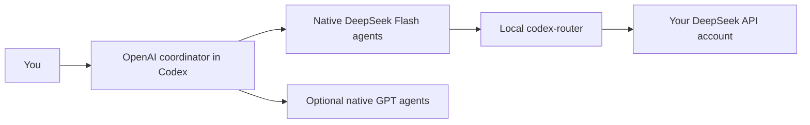

# Codex + native DeepSeek subagents

Keep your selected OpenAI model as the conversation and planning agent, and give implementation work to **DeepSeek V4 Flash agents inside Codex's native Subagents panel**. Ordinary GPT subagents can still be used alongside them.

This repository packages the Windows workflow developed and tested by KnightGlider: the source patches, portable setup scripts, beginner tutorial, download checksums, build workflow, verification harness, and rollback instructions. It is an **unofficial, version-pinned community integration**, not an OpenAI or DeepSeek product.



## Start here

**Read the [Windows setup tutorial](docs/setup-windows.md).** It walks through installing the router, entering your own API key in its private prompt, obtaining the patched runtime, installing the role, launching Codex, and proving the result.

```powershell
git clone https://github.com/KnightGlider/codex-deepseek-native.git
cd codex-deepseek-native
```

You need the Codex desktop app signed in to ChatGPT and your own DeepSeek API access. This kit never includes an API key or account configuration. The provider/model must be available to your account.

The setup script takes a **patched runtime directory**, not the stock Codex executable:

```powershell
$runtime = Join-Path $env:USERPROFILE '.codex-deepseek-native\runtime'
powershell.exe -NoProfile -ExecutionPolicy Bypass -File .\scripts\Install-DeepSeekNative.ps1 -RuntimeDirectory $runtime -CreateDesktopShortcut
```

Obtain and unpack the runtime first, following the tutorial. Close Codex completely and use the new shortcut. The launcher passes `CODEX_CLI_PATH` only to the new process; it does not replace the installed app or change the saved main model.

## Downloads and builds

- [Releases](https://github.com/KnightGlider/codex-deepseek-native/releases): setup-kit downloads and any published runtime releases.
- [Build workflow](https://github.com/KnightGlider/codex-deepseek-native/actions/workflows/build-windows-msvc.yml): clean Windows runtime builds. An artifact is usable only after its run succeeds; a workflow file is not evidence of a passing build.
- [Official download links and checksums](docs/downloads.md).
- [Build from source](docs/build-from-source.md).

The original machine-specific debug executable is **not committed or republished**. Clean build artifacts must include checksums, source provenance, and upstream licenses. Runtime binaries belong in release assets or Actions artifacts, never ordinary Git history.

## What is pinned

| Component | Tested base |
| --- | --- |
| Codex source/CLI | `rust-v0.153.4`, commit `3d2ee51ca2d5db578f328aa75e20aa22c0197c9a` |
| Codex Router | `v0.5.1`, commit `b90aa60e257bbcc33855aad7d43954c1a09b1311` |
| Desktop tested locally | Windows x64, `26.903.9818.0` |
| DeepSeek role | `deepseek_flash` → `deepseek/deepseek-v4-flash`, high reasoning |

Newer versions, other operating systems, and other accounts are not automatically covered. The new MSVC CI route is distinct from the original GNU build; consult the actual workflow result before using its artifacts.

## Use it

After verifying the patched backend and role, ask your coordinator:

> Keep my selected OpenAI model as the coordinator. Use three native `deepseek_flash` agents on high reasoning for separate implementation tasks. Give each agent explicit file ownership and acceptance checks. Review their work and run the final checks yourself. If that native role is unavailable, tell me instead of silently substituting GPT workers.

The coordinator selects `agent_type="deepseek_flash"` and omits a model override. For ordinary GPT workers, it omits that role. Follow-up messages can resume the same child, and finished children should be closed/interrupted so the panel marks them done.

## What was verified, and what was not

The local implementation was tested with native GPT and DeepSeek agents running concurrently, a follow-up to the same DeepSeek child, actual file edits, and the desktop Subagents panel. A larger three-agent game exercise also completed. [Verification details](docs/verification.md) distinguish those observations from unit checks and broader test failures.

There were **streamed tool-argument failures** during larger assignments; some agents needed resuming. This is not a guarantee of uninterrupted execution, unlimited output, unlimited context, or a particular cost saving. DeepSeek calls use your DeepSeek API account, and the coordinator still uses your OpenAI account. Check actual usage rather than estimating savings from model names.

A requested one-million-token context setting was capped at 828,400 effective tokens in the tested main-model setup. Context limits depend on the selected model and account; this kit does not override provider limits.

## Contents

- `patches/`: the native provider-routing patch and router follow-up cleanup fix.
- `scripts/`, `config/`, `tests/`: portable installation, launch, verification and rollback.
- `verification/`: a real native-agent integration harness, observer fixtures, and official download metadata. Live runs use your accounts and incur their normal usage.
- `build/`, `.github/workflows/`: clean source-build automation.
- `docs/`: setup, architecture, source builds, downloads, troubleshooting and test evidence.
- `licenses/`, `LICENSE`, `NOTICE`: upstream attribution and licensing.

Do not commit user configuration, credentials, raw run traces, local account screenshots, or build caches. Local debug builds can consume very large amounts of disk space; use isolated output directories and the documented cleanup procedure. Never clean the active runtime directory.

## Troubleshooting and rollback

See [troubleshooting](docs/troubleshooting.md) for missing roles, wrong backend paths, interrupted tool streams and version mismatches. Use the rollback script described in the tutorial to remove only this kit's managed configuration. Do not restore an old full configuration over later user changes.

## Credits

This work builds on [OpenAI Codex](https://github.com/openai/codex) and [Codex Router](https://github.com/duolahypercho/codex-router). Official Codex references: [subagents](https://learn.chatgpt.com/docs/agent-configuration/subagents) and [configuration](https://learn.chatgpt.com/docs/config-file/config-reference).

The kit is licensed under Apache-2.0; the router-derived patch retains its upstream MIT license. See `NOTICE` and `licenses/` for attribution. Do not submit credentials or raw private traces in issues.